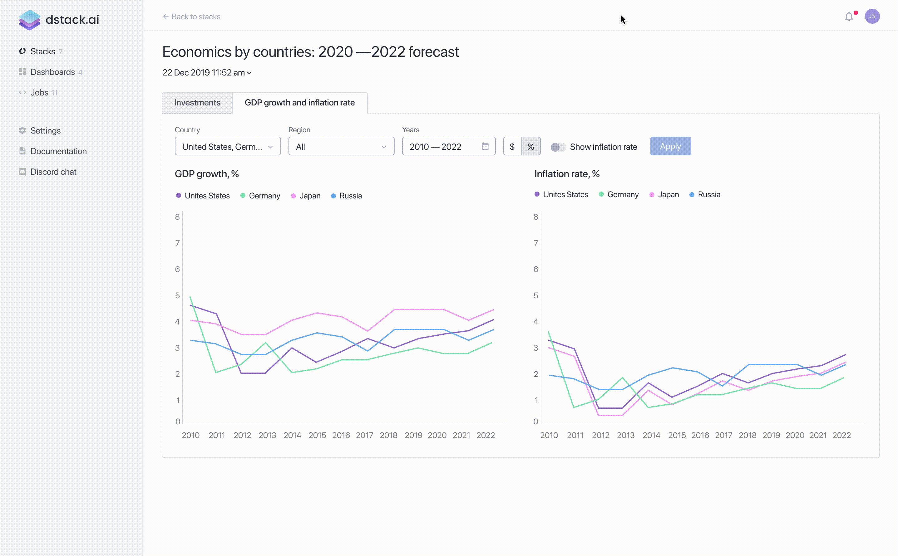

# What is dstack?

[dstack.ai](https://dstack.ai) is an open-source tool and an enterprise platform for building data and ML applications using Python and R.

How is dstack different from other frameworks \(Plotly, Streamlit, Shiny, etc\):

* It simplifies the process of creating applications by 
  * a\) decoupling ML development and application development \(by introducing an ML Registry\) 
  * b\) leveraging a declarative approach to defining application components \(ML models, datasets, reports, jobs, etc\)
* It is designed for data scientists and doesn't require development skills to build applications.

### **How dstack works**

The framework consists of the following parts:

* **Client packages** for Python \([dstack-py](https://github.com/dstackai/dstack-py)\) an R \([dstack-r](https://github.com/dstackai/dstack-r)\). These packages can be used from either notebooks or scripts to push data to dstack.
* **A server application** \([dstack-server](https://github.com/dstackai/dstack-server)\). It handles the requests from the Client packages, and serve data applications. The application can run locally or in Docker.

A data science application is a specific kind of application that solves domain-specific problems using data and data science methods. These data science methods may include data-wrangling, data visualizations, statistical modeling, machine learning, etc.

### **Building data science applications**

There are several general use-cases for such data science applications:

1. **Reports** – interactive visualizations with different layouts
2. **Model registry** - Once, you've trained an ML model, you can push it to dstack.ai using the Python's push function. Later, you can pull this model to use anywhere: in a notebook, script, job, or application.
3. **Jobs** – Automate the routine of processing datasets or updating dashboards, by running regular Python or R jobs and monitoring their progress.
4. **Applications** – Interactive applications that run on the server and let users to interact with ML models and data sources \(not supported yet\)

Currently, dstack supports _Reports_, _Model registry_, and _Jobs_. The support for _Applications_ is coming soon.



Currently, dstack supports only _Interactive reports_. The support for _Live Reports_ and _Machine learning applications_ is coming very soon.


Check out this [quick tutorial](tutorials/dashboards-tutorial.md) on how to build interactive reports with dstack in minutes.


### **Automating scientific routines**

The dstack in-cloud and on-premises versions allow you to execute Python and R jobs right – either on demand or automatically at a regular schedule.



The jobs are ideal for processing data regularly and publishing the results, e.g. in the form of data visualizations, datasets, or other artifacts.

