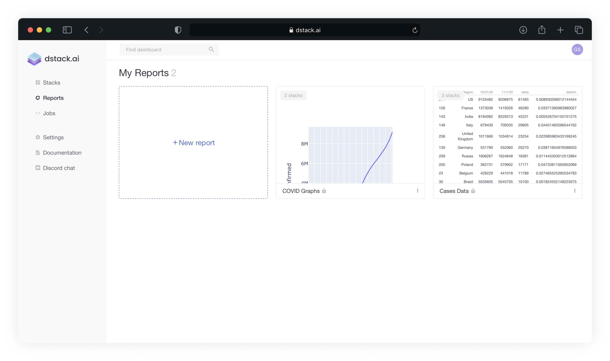

# Reports \(Deprecated\)

## What are Reports?


Please note that **Reports** will be **deprecated** in the future versions of dstack \(from `version 0.6` onwards\). You will be able to create "Reports" in the form of applications in the future. Please refer to the [Applications](applications.md) section for more details.


You would often need to tell stories based in the data in your application with visualisations and models you have created by combining multiple Stacks together. This is where Reports come into play.

A Report can be thought of as a **collection of multiple stacks**. If a **Stack** displays each moment a single visualization that corresponds to the selected parameters, a **Report** displays multiple visualizations at once – also based on selected parameters. In order to build a Report, you only need to push your visualizations via Python or R API as Stacks and then combine them into one Report with a few clicks.


Here's an example of a simple report: [https://dstack.ai/cheptsov/d/505d2087-9adc-49e3-88de-6b46079c394f](https://dstack.ai/cheptsov/d/505d2087-9adc-49e3-88de-6b46079c394f)



Note: Reports used to be referred to as Dashboards in older versions of dstack. If you had previously created or saved Dashboards, they will now appear under the new label of Reports.


## Creating a Report

1. First create **Stacks** by [pushing](pushing-visualizations.md) your visualizations via the Python or R API. Those can be either Static or Interactive stacks. 
2. Click **Reports** in the sidebar of [dstack.ai](https://dstack.ai) and then click **New Report**.
3. You'll see a new empty Report. Now, go ahead, click **Add Stack**, and select the Stacks that you'd like to put to your Report. You can add as many Stacks as you'd like
4. Once you've selected the **Stacks**, click **Add selected stacks**. You'll see the selected **Stacks** added to the current **Report.**
5. Now you can change the title of the Report or any of the Stacks by mouse-clicking their titles.

## Sharing Reports

In order to share the report with others you can click **Share** on the top right of your report.

You can switch the **access level** for this Report between **Public** \(Everyone with the link can view it\) and **Private** \(share it with specific users by entering their usernames or emails\).

The user with whom you've shared the report will be able to open the report and see it updating based on the parameters selected. Note, the parameters are shown only in case the added stacks have parameters.

**That's it! Go ahead, and build your interactive reports right away! 🚀**

