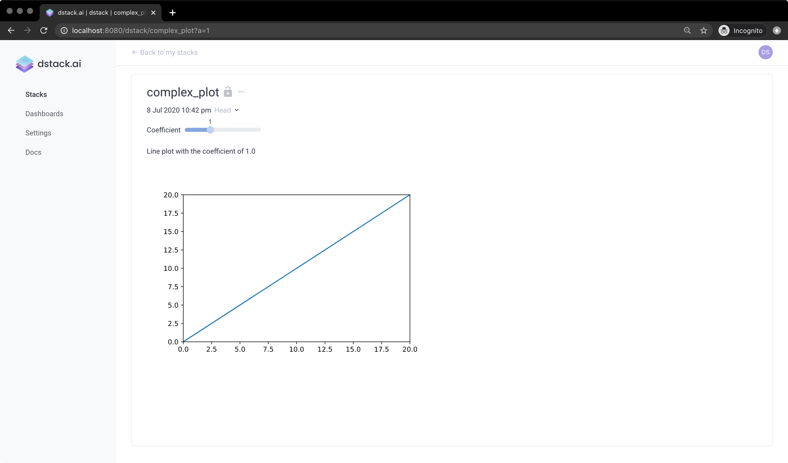
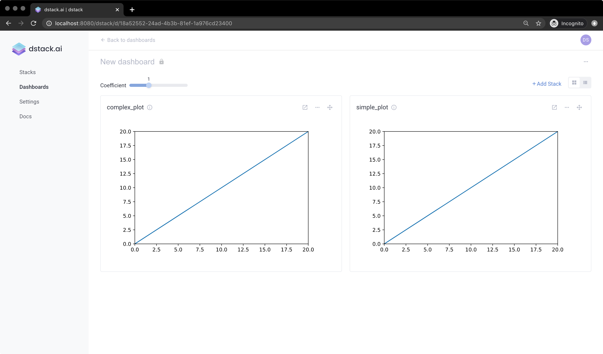
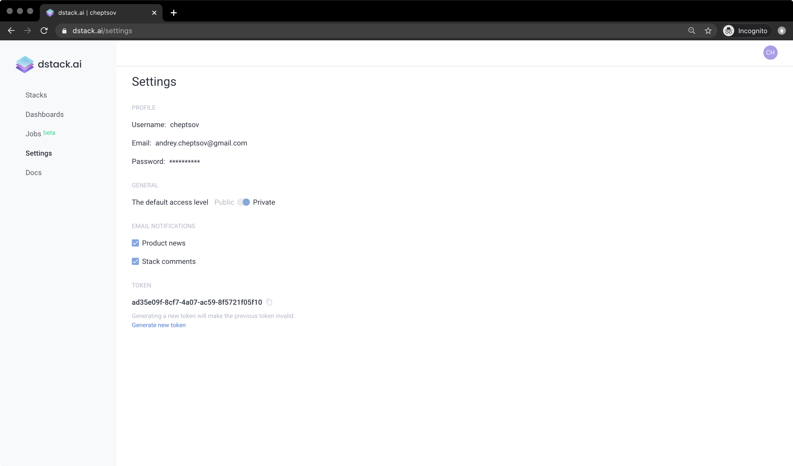
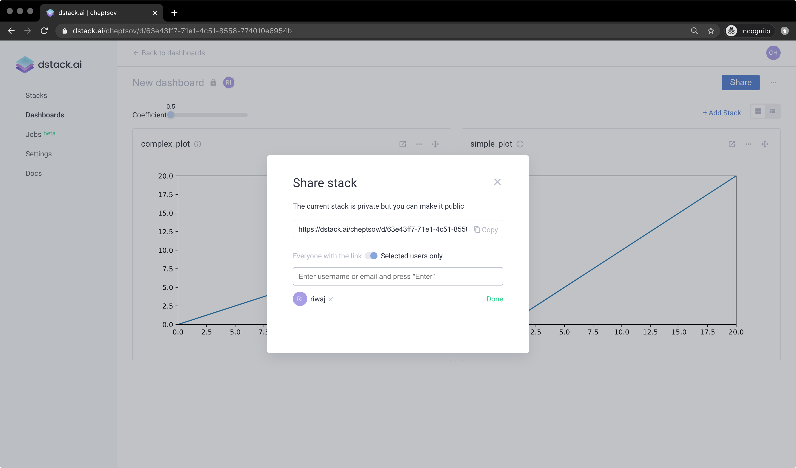

# Building Interactive Dashboards

## A quick start guide on building dashboards with dstack and Python


In order to follow this tutorial, you'll only need Conda or pip, a terminal, and a browser. Going through this tutorial will take not more than 10 minutes.



If you have already completed the installation and configuration steps, you can jump straight to [part 4 ](dashboards-tutorial.md#4-pushing-visualizations)of this tutorial \(Pushing Visualizations\) 


### 1. Installation

Open your Terminal and install the `dstack` package using `conda`:

```bash
conda install dstack -c dstack.ai
```

If you don't use Conda, you can install `dstack` via `pip`:

```bash
pip install dstack
```

Along with `dstack`'s modules for Python the package will install the command line utility named dstack.

### 2. Starting server

If you'd like to host your dashboard the in-cloud, you'll need to [register](../in-cloud/cloud-registration.md) an account on [dstack.ai](https://dstack.ai) and use its username and token. However, if you'd like to host your dashboard locally, you'll need to launch the dstack server locally using the following command:

```bash
dstack server start
```

If you invoke the command the first time, it will download and install the dstack server. In this case the command may take a while. Please don't worry, you just need to wait. Next time, the server will start immediately.

Once the setup is over, you'll see the following output:

```text
To access the dstack server, open one of these URLs in the browser:
        http://localhost:8080/auth/verify?user=dstack&code=xxxxxxxx-xxxx-xxxx-xxxx-xxxxxxxxxxxx&next=/
    or    http://127.0.0.1:8080/auth/verify?user=dstack&code=xxxxxxxx-xxxx-xxxx-xxxx-xxxxxxxxxxxx&next=/

If you're using Python, use the following command line command to configure your dstack profile:
    pip install dstack
    dstack config add --token xxxxxxxx-xxxx-xxxx-xxxx-xxxxxxxxxxxx --user dstack --server http://localhost:8080/api

If you're using R, use the following R command to configure your dstack profile:
    install.packages("dstack")
    dstack::configure(user = "dstack", token = "xxxxxxxx-xxxx-xxxx-xxxx-xxxxxxxxxxxx", persist = "global", server = "http://localhost:8080/api")
```

The server normally runs on 8080. If you'd like it to run on a different port, use the command line option `--port`:

```bash
dstack server start --port 8081
```

If you'd like to see the other server options, feel free to run `dstack server --help`.

### 3. Configuring profile

In order to push data to the dstack server, you have to configure your dstack profile. This is done by using the command that was given by the server:

```bash
dstack config add --token xxxxxxxx-xxxx-xxxx-xxxx-xxxxxxxxxxxx --user dstack --server http://localhost:8080/api
```


Note, if you'd like to host your data on the in-cloud version, you'll have to use the username and token values taken from your account Settings page. For the in-cloud version, the option `server` is not required.


If you'd like to see the other configuration options, feel free to run `dstack config --help`.


Note, by default, the server stores all the data under `.dstack`in the user home directory.

In case you'd like to store the `.dstack` folder in a different place, use the following command:

```text
dstack server start --home <other_directory>
```


Now, that you've set up your profile and pointed it to a running server or the in-cloud service, you can push data and build dashboards.

### 4. Pushing visualizations

Before you can combine your data into a dashboard, you have to push your visualizations to the server. This can be done via the dstack package for Python or R. In our tutorial, we'll use the Python package.

The easiest way yo work with dstack Python package is from a Jupyter notebook.

Go ahead and run you Jupyter notebook using this command:

```bash
jupyter notebook
```

In case you don't have Jupyter installed, you can quickly install it via `conda install jupyter` or `pip install jupyter`.

Let's create a new Python 3 notebook and define a function that returns a plot. In this tutorial we'll `matplotlib`, but if you want to can use something else, e.g. `plotly:`

```python
import matplotlib.pyplot as plt

def line_plot(a):
    xs = range(0, 21)
    ys = [a * x for x in xs]
    fig = plt.figure()
    plt.axis([0, 20, 0, 20])
    plt.plot(xs, ys)
    return fig
```

Now, invoke this function with some parameter in the next cell:

```python
fig = line_plot(1)
```

If everything is fine, you'll see the visualization rendered in the cell output.

Now, let's push this visualization to the dstack server:

```python
import dstack as ds

ds.push("simple_plot", fig, """
# My simple plot

How do you like my plot?""")
```

If you run this code in Jupyter, you'll see a link in the output. You can use this link to access the visualization on the dstack server.

Open the link from the output in the browser to see how it works.

Now let's do something more complex. Invoke the function in the loop with different arguments and push resulted plots at once to the server:

```python
import dstack as ds

frame = ds.frame("complex_plot")
coeff = [0.5, 1.0, 1.5, 2.0]

for c in coeff:
    frame.commit(line_plot(c), f"Line plot with the coefficient of {c}", {"Coefficient": c})

frame.push()
```

Open the link from the output in the browser to see the result, and try to change parameters:



As you see the server let you change the parameter and shows you the visualization that corresponds to the selection. When you submit visualizations to the server, you're allowed to use as many parameters as you want. The server will automatically combine them into interactive selection control widgets.

### 5. Building a dashboard

After you've pushed your visualizations to the server, you can combine them into an interactive dashboard and apply a required layout.

To create a dashboard, make sure you've logged in to the dstack web application using the link provided by the `dstack server` command. If you don't log in, you'll see the web application as a guest user and won't be able to manage dashboards.

When you're logged in, click `Dashboards` on the left-hand panel and then click `New dashboard`. In the popup, you'll see all available Stacks \(this is how visualizations are called by the server\). Select those Stacks that you'd like to add to your dashboard.



You can change the layout using the icons in the right-top corner, change the dashboard's and stacks' titles.

By default, the server makes all pushed visualizations and dashboards public. You can set the access level for any stack to private when you push it from the Python code by adding the argument `access` to the `create_frame` or `push_frame` functions set to `'private'`:

```python
import dstack as ds

ds.push_frame("simple_plot", fig, """
# My simple plot

How do you like my plot?""", access = "private")
```

In case you're hosting the data with the in-cloud version of dstack.ai, you'll be able to change the default access level in the settings:



Another feature of the in-cloud version of dstack.ai is the `Share` button that is available for both stacks and dashboards. If you click this button, you'll be able to change the access level for any stack or dashboard individually and also share it with specific users of dstack.ai.



If the user is not registered, you can use the email. In that case, dstack.ai will send an invitation link to the user.

